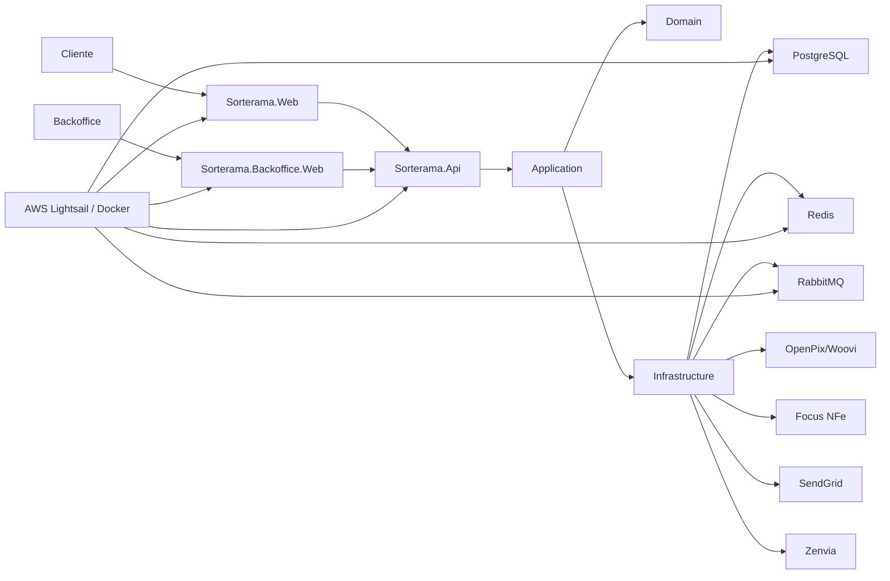
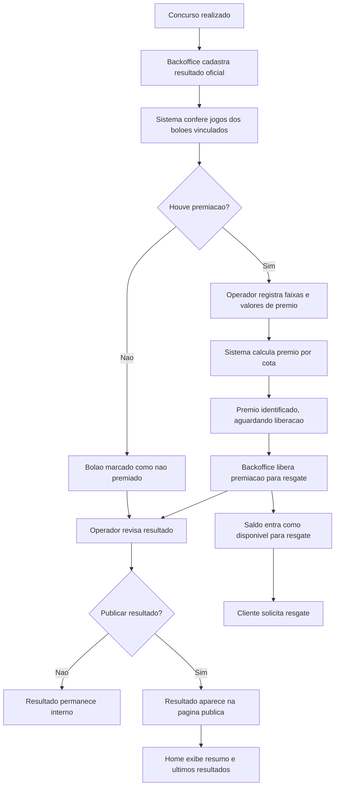

# Sorterama - Arquitetura do MVP

Data: abril de 2026.
Ultima revisao: 09/07/2026.

Este documento e a fonte de verdade para arquitetura, operacao, integracoes e observabilidade do MVP.

## Objetivo do Produto

Sorterama e uma plataforma para venda e gestao de boloes, com checkout Pix, backoffice operacional, conciliacao financeira e emissao de NFS-e sobre a taxa de administracao.

O MVP deve permitir:

- publicar produtos, concursos e boloes;
- gerar concursos e boloes em lote a partir de modelos configuraveis;
- vender cotas avulsas e pacotes mensais;
- receber pagamento Pix via OpenPix/Woovi;
- confirmar pedidos de forma idempotente;
- registrar jogos/participacoes em loterias oficiais por bolao;
- registrar resultado oficial, conferir jogos, registrar premiacao, liberar resgate e publicar resultados;
- registrar ledger financeiro;
- emitir NFS-e de forma assincrona;
- notificar cliente sobre compra e nota fiscal;
- oferecer relatorios operacionais, financeiros e fiscais no backoffice.

## Projetos

```text
Sorterama.Api                 API, hosted services, webhooks e composicao da aplicacao
Sorterama.Application         Casos de uso, CQRS, handlers, DTOs e servicos de aplicacao
Sorterama.Domain              Entidades, enums, eventos e contratos de repositorio
Sorterama.Infrastructure      EF Core, repositorios, mensageria, integracoes e providers
Sorterama.Infraestructure.Ioc Registro de dependencias de infraestrutura
Sorterama.Web                 Experiencia publica e area logada do cliente
Sorterama.Backoffice.Web      Backoffice administrativo, financeiro e fiscal
Sorterama.BuildingBlocks      Contratos, options, tipos compartilhados e utilitarios
Sorterama.Test                Testes automatizados
Sorterama.Documentation       Documentacao viva do projeto
deploy/lightsail              Infraestrutura de homologacao em AWS Lightsail
```

## Stack

- .NET 10 (`net10.0`) em todos os projetos da solucao
- ASP.NET Core 10 com Razor Pages na loja e no backoffice
- ASP.NET Core Identity para contas, cookies de sessao e tokens de aplicacao
- MediatR 12 para CQRS e orquestracao de casos de uso
- Entity Framework Core 10 com provider `Npgsql.EntityFrameworkCore.PostgreSQL` 10.0.1
- PostgreSQL 15 como banco principal
- Redis 7 para cache distribuido e suporte a carrinho
- RabbitMQ 3 com plugin de management para mensageria assincrona
- OpenTelemetry 1.14 com exporter Prometheus
- Docker Compose para ambiente local e homologacao em AWS Lightsail

Bibliotecas e providers relevantes:

- `SendGrid` 9.29.3 para e-mails transacionais
- `RabbitMQ.Client` 6.7.0
- `Microsoft.Extensions.Caching.StackExchangeRedis` 10.0.6
- `Microsoft.AspNetCore.Identity.EntityFrameworkCore` 10.0.6
- `Microsoft.EntityFrameworkCore` 10.0.6

## Canais e Providers Atuais

### Pagamentos

- Pix: OpenPix/Woovi
- fallback local: `MockPixGateway` quando `OpenPix__Enabled=false` ou `OpenPix__AppId` nao estiver configurado

### Comunicacao

- E-mail transacional: SendGrid
- SMS: Zenvia SMS
- WhatsApp: Zenvia WhatsApp
- fallback local para mensageria: `NullSmsService` e `NullWhatsAppService` quando `Zenvia__Enabled=false` ou `Zenvia__ApiToken` estiver vazio

### Fiscal

- provider fiscal principal: Focus NFe
- fallback local: `MockServiceInvoiceProvider` quando `ServiceInvoiceProvider__Provider=Mock`

### Storage e suporte operacional

- arquivos locais em desenvolvimento via `LocalStorageService`
- Amazon S3 fora de desenvolvimento
- consultas auxiliares de endereco e localidade: ViaCEP, BrasilAPI e IBGE

## Visao C4 Simplificada



## Fluxo de Pagamento e Fiscal

1. Cliente monta carrinho e inicia checkout Pix.
2. API cria cobranca no OpenPix.
3. Webhook positivo marca pagamento e pedido como pagos.
4. Ledger registra a composicao financeira.
5. A taxa de administracao gera `ServiceInvoice`.
6. A aplicacao publica `service-invoice.requested` no RabbitMQ.
7. O handler fiscal emite NFS-e via `IServiceInvoiceProvider`.
8. O polling fiscal acompanha notas pendentes.
9. Cliente recebe e-mail com numero da nota e link externo.
10. Backoffice cruza nota, pedido pago e ledger no relatorio fiscal.

Regra fiscal do MVP: a NFS-e cobre a taxa de administracao. Para um mesmo bolao no mesmo pedido, a taxa de administracao e cobrada uma unica vez, mesmo que o cliente compre mais de uma cota.

## Publicacao de Concursos e Boloes

O backoffice suporta dois caminhos operacionais para disponibilizar ofertas na loja.

### Publicacao manual

1. Publisher cria ou edita o produto.
2. Publisher cria ou edita o concurso.
3. Approver abre o concurso para vendas.
4. Publisher cria o bolao vinculado ao produto e ao concurso.
5. Publisher cadastra ou importa os jogos/participacoes em loterias oficiais do bolao.
6. Publisher envia produto e bolao para aprovacao.
7. Approver aprova e publica produto e bolao.
8. A loja publica lista a oferta quando produto, concurso, bolao, jogos, janela de venda e cotas estao coerentes.

### Geracao em lote

1. Administrador configura modelos de geracao por loteria e tipo de oferta.
2. A acao "Gerar Boloes do Proximo Mes" calcula os concursos futuros conforme dias da semana configurados.
3. A rotina cria concursos e boloes futuros de forma idempotente.
4. A rotina cria o bolao mensal da Mega-Sena com os concursos do periodo, quando o modelo estiver ativo.
5. Itens ja existentes no mesmo periodo nao sao duplicados.
6. Os itens gerados devem permanecer em fluxo operacional interno ate que os jogos/participacoes em loterias oficiais sejam cadastrados ou importados.
7. O operador revisa, ajusta valores, premio acumulado, cotas, observacoes e status antes da publicacao.

Modelos vigentes no MVP:

- Mega-Sena: terca, quinta e sabado;
- Lotofacil: segunda a sabado;
- Quina: segunda a sabado;
- bolao mensal Mega-Sena com todos os concursos da competencia.

### Cadastro e importacao de jogos

Cada bolao pode ter um ou muitos jogos/participacoes em loterias oficiais. O limite de jogos por bolao nao e fixado pela arquitetura, para permitir fechamentos, desdobramentos e combinacoes futuras.

Modelo de importacao CSV:

```text
LotteryType;GameNumber;Numbers;Source;ProviderBetId;ReceiptUrl;Notes
Mega-Sena;1;"01,05,12,23,44,60";Manual;;;
Mega-Sena;2;"02,08,19,31,45,59";Manual;;;
```

Regras:

- `LotteryType` e obrigatorio e deve bater com as modalidades suportadas;
- `Numbers` e obrigatorio e deve usar dezenas separadas por virgula;
- Mega-Sena exige minimo de 6 dezenas, faixa 01-60;
- Quina exige minimo de 5 dezenas, faixa 01-80;
- Lotofacil exige minimo de 15 dezenas, faixa 01-25;
- dezenas repetidas no mesmo jogo sao rejeitadas;
- `ReceiptUrl` e opcional;
- se `GameNumber` vier vazio, o sistema pode gerar a numeracao sequencial;
- se houver qualquer erro, a importacao inteira e rejeitada e nenhuma linha e gravada.

O objetivo e garantir que nenhum bolao seja publicado sem base operacional suficiente para conferencia posterior.

## Resultado, Conferencia e Premiacao

O ciclo de resultado foi separado do ciclo de venda para manter rastreabilidade e evitar expor informacoes incompletas ao cliente.



Entidades principais:

- `LotteryResult`: resultado oficial do concurso, publicacao publica e observacao publica;
- `PoolResult`: relatorio operacional de conferencia do bolao, melhor acerto, jogos conferidos, status e faixas informadas;
- `PoolGameResult`: conferencia por jogo;
- `PoolPrizeTier`: faixas de premiacao;
- `PoolPrize`: registro financeiro da premiacao, vinculado ao bolao e opcionalmente ao `PoolResult`;
- `PoolPrizeShare`: valor esperado por cliente/cota, usado como base para saldo e resgate;
- `PrizeWithdrawalRequest`: solicitacao de resgate do cliente;
- `PrizeWithdrawalMovement`: trilha de auditoria do ciclo de saque.

Regras de premiacao e resgate:

- `PoolResult` nao deve ser usado como saldo financeiro; ele e o relatorio de conferencia.
- `PoolPrize` nasce como premio identificado/aguardando liberacao.
- O saldo do cliente so considera `PoolPrize` com status disponivel para resgate.
- A liberacao administrativa e idempotente: reexecutar a acao nao duplica saldo nem cotas.
- O calculo por cota considera cotas pagas/elegiveis.
- Bolao sem jogos deve aparecer como pendencia operacional e nao deve seguir para premiacao financeira.
- A area `Account/Prizes` informa que, apos liberacao, o prazo estimado para pagamento e de 5 a 10 dias uteis.

APIs publicas anonimas:

- `GET /api/public/results`
- `GET /api/public/results/{id}`
- `GET /api/public/results/summary`
- `GET /api/public/results/latest`
- `GET /api/public/results/prizes/latest`

Regra de exposicao publica:

- apenas `LotteryResult` marcado como publico aparece na loja;
- resultados ocultos retornam como nao encontrados;
- pedidos, clientes, documentos e dados financeiros internos nao sao expostos na API publica;
- bolao sem conferencia aparece como "Aguardando conferencia".

## Onboarding, Autenticacao e Sessao

Fluxos vigentes em 25/04/2026:

1. O onboarding da loja publica acontece em quatro etapas.
2. O usuario informa dados pessoais, contato, endereco, senha e aceite de termos.
3. A verificacao de contato e obrigatoria antes da conclusao do cadastro.
4. O canal prioritario e telefone via WhatsApp/SMS.
5. O canal alternativo e e-mail, quando `OnboardingVerification__AllowEmailFallback=true`.
6. O horario exibido para expiracao e confirmacao do codigo na UI e horario do Brasil.
7. Ao concluir o cadastro, o usuario recebe e-mail de boas-vindas com a mensagem "Bem-vindo(a) a Sorterama!" e imagem `muri_celebracao`, sem link de confirmacao.

Autenticacao disponivel:

- login classico com senha
- login sem senha por codigo

Fluxo do login sem senha:

1. cliente informa e-mail ou CPF;
2. sistema resolve o telefone do cliente;
3. envia codigo por WhatsApp/SMS;
4. cliente informa codigo de 6 digitos;
5. a loja cria sessao via cookie e preserva o carrinho anonimo, quando houver.

Observacoes operacionais:

- o polling do badge de carrinho nao roda mais nas telas de autenticacao;
- o login por codigo depende do estado `LoginOtpChallenge`;
- falhas de validacao devem ser observadas primeiro nos logs da `Sorterama.Web`, antes da API.

## Mensageria

RabbitMQ e usado para processamento assincrono.

Filas/eventos relevantes:

- `preregistration.created`
- `user.registered`
- `service-invoice.requested`

Padrao recomendado:

- publicar `MessageId` e `CorrelationId`;
- logar routing key, fila, delivery tag, event type e duracao;
- nunca logar payload completo;
- usar retry/DLQ para falhas transientes;
- tornar handlers idempotentes.

## Integracoes Externas

### OpenPix/Woovi

Responsavel por cobranca Pix, QR code e webhook de pagamento.

Cuidados:

- nao logar payload bruto de webhook;
- validar `X-OpenPix-Signature` por HMAC-SHA1 quando `OpenPix__WebhookSecret` estiver configurado;
- validar `x-webhook-signature` por RSA com a chave publica da Woovi embutida no handler;
- tratar replay como idempotente;
- registrar status, correlation id e duracao.

### Focus NFe

Responsavel pela emissao de NFS-e quando o provider fiscal estiver configurado.

Ambientes:

- homologacao: `https://homologacao.focusnfe.com.br`
- producao: `https://api.focusnfe.com.br`

Cuidados:

- manter token por ambiente;
- nao bloquear confirmacao de pagamento por falha fiscal;
- emitir nota por fila;
- acompanhar status por polling;
- expor pendencias no backoffice.

### Comunicacao

SendGrid e usado para e-mails transacionais. Zenvia e usada para SMS/WhatsApp. Quando o provider nao estiver ativo, os servicos nulos registram logs e evitam quebrar o fluxo local.

Cuidados:

- nao logar corpo de mensagem;
- mascarar telefone/e-mail quando necessario;
- registrar tipo de mensagem, status e contexto interno.

Mensagens transacionais ativas:

- codigo de verificacao de onboarding por e-mail;
- boas-vindas ao concluir cadastro;
- confirmacao de compra;
- emissao de nota fiscal;
- notificacoes de resultado e premio, quando aplicavel.

## Linguagem e Compliance

Por orientacao de compliance, comunicacoes e documentos devem evitar termos que confundam a atividade da plataforma com operacao direta de jogos comerciais. A linguagem padrao e:

```text
jogos/participacoes em loterias oficiais
```

Aplicar esta regra em:

- paginas publicas;
- backoffice;
- area logada;
- e-mails transacionais;
- SMS/WhatsApp;
- seeds e textos descritivos;
- documentos legais e politicas publicas.

Termos tecnicos internos existentes podem ser mantidos temporariamente quando a renomeacao implicar migracao ou quebra de contrato, mas textos exibidos ao usuario devem seguir a linguagem padrao.

## Deploy em AWS Lightsail

Arquitetura de homologacao:

- Caddy exposto nas portas 80/443;
- `sorterama-web`, `sorterama-api` e `sorterama-backoffice` como containers internos;
- Postgres, Redis e RabbitMQ privados na rede Docker;
- painel RabbitMQ preso a `127.0.0.1` para acesso via SSH tunnel;
- secrets reais no `.env` do servidor ou no pipeline, nunca versionados.

Containers e dependencias de homologacao:

- `sorterama-web`
- `sorterama-backoffice`
- `sorterama-api`
- `sorterama-db` (PostgreSQL 15)
- `sorterama-redis` (Redis 7)
- `rabbitmq` (RabbitMQ 3-management)
- `caddy`

Comandos operacionais principais no servidor:

```bash
cd /opt/sorterama/deploy/lightsail
docker compose --env-file .env pull
docker compose --env-file .env up -d --remove-orphans
docker compose --env-file .env ps
docker compose --env-file .env logs -f sorterama-api
```

## Logs e Observabilidade

Estado atual:

- uso de `ILogger` em API, filas, webhooks, hosted services e integracoes;
- `GlobalExceptionHandlingMiddleware` registra excecoes com `TraceId`;
- RabbitMQ registra recebimento, retry, ack e falha;
- OpenTelemetry Metrics exposto para Prometheus;
- ainda nao ha tracing distribuido nem exportacao de logs para AWS.

Correcoes ja aplicadas:

- query string completa nao e mais logada em excecao global;
- payload completo RabbitMQ nao e mais logado;
- URI RabbitMQ com usuario/senha nao e mais logada;
- corpo bruto de resposta OpenPix nao e mais logado em falhas;
- SMS/WhatsApp noop nao logam mensagem completa.

Configuracao recomendada de nivel:

```json
{
  "Logging": {
    "LogLevel": {
      "Default": "Information",
      "Microsoft": "Warning",
      "Microsoft.AspNetCore": "Warning",
      "Microsoft.EntityFrameworkCore.Database.Command": "Warning",
      "System.Net.Http.HttpClient": "Warning",
      "Sorterama.Api": "Information",
      "Sorterama.Application": "Information",
      "Sorterama.Domain": "Information",
      "Sorterama.Infrastructure": "Information",
      "Sorterama.Infraestructure.Ioc": "Information",
      "Sorterama.BuildingBlocks": "Information"
    }
  }
}
```

Regras de seguranca para logs:

- nao logar tokens, senhas, payloads completos, QR code, corpo bruto de provider ou link sensivel;
- preferir `OrderId`, `PaymentId`, `ServiceInvoiceId`, `CustomerId`, `TraceId`, status, duracao e codigo de erro;
- mascarar telefone/e-mail quando a identificacao direta nao for indispensavel;
- manter `Debug` desligado em producao.

Lacunas para homologacao:

- logs JSON no console;
- correlacao ponta a ponta por `TraceId`/`CorrelationId`;
- CloudWatch Logs com retencao definida;
- alarmes para excecao API, falha de fila, falha OpenPix e falha NFS-e;
- trilha de auditoria melhor para acoes criticas no backoffice.

Log groups sugeridos:

- `/sorterama/homolog/api`
- `/sorterama/homolog/web`
- `/sorterama/homolog/backoffice`
- `/sorterama/homolog/caddy`
- `/sorterama/homolog/rabbitmq`

Retencao inicial:

- homologacao: 14 ou 30 dias;
- producao: 30 a 90 dias, conforme custo e necessidade operacional.

## Comandos de Validacao

```powershell
dotnet restore Sorterama.sln --disable-parallel -v minimal -p:RestoreUseStaticGraphEvaluation=true
dotnet build Sorterama.sln --no-restore -v minimal /m:1 /nodeReuse:false /p:UseSharedCompilation=false
dotnet test Sorterama.Test\Sorterama.Test.csproj --no-restore -v minimal /m:1 /nodeReuse:false /p:UseSharedCompilation=false
```

Quando houver lock em `bin\Debug`, validar com pasta de saida separada:

```powershell
dotnet build Sorterama.Api\Sorterama.Api.csproj --no-restore -v minimal /m:1 /nodeReuse:false /p:UseSharedCompilation=false -o artifacts\build-check\api
```

## Configuracoes Criticas

Variaveis e secoes sensiveis para rodar o MVP:

- `ConnectionStrings__SqlConnection`
- `Redis__ConnectionString`
- `EventBusConfiguration__HostAddress`
- `Jwt__Key`
- `AdminSeed__Password`
- `SorteramaApi__BaseUrl` na loja e no backoffice
- `WebApp__BaseUrl` na API
- `Otp__Pepper`
- `OpenPix__Enabled`, `OpenPix__BaseUrl`, `OpenPix__AppId`, `OpenPix__WebhookSecret`
- `SendGrid__ApiKey`, `SendGrid__FromEmail`, `SendGrid__AssetsBaseUrl`
- `Zenvia__Enabled`, `Zenvia__ApiToken`
- `ServiceInvoiceProvider__Provider`
- `FocusNfe__*`
- `SORTERAMA_DP_KEYS_DIR`

Para desenvolvimento local, e aceitavel usar:

- Pix em modo mock
- provider fiscal mock
- SMS/WhatsApp noop

O guia operacional para setup local fica em `Sorterama.Documentation/local-development.md`.

## Pendencias Tecnicas Recomendadas

- configurar logs estruturados em JSON;
- adicionar correlation id HTTP e RabbitMQ;
- configurar CloudWatch Logs no Lightsail;
- revisar logs de e-mail/SMS para reduzir PII;
- revisar `Serilog` no `appsettings.Development.json`, pois nao ha inicializacao aparente no `Program.cs`;
- criar alarmes operacionais minimos;
- atualizar diagramas formais se o produto passar da homologacao para producao.
