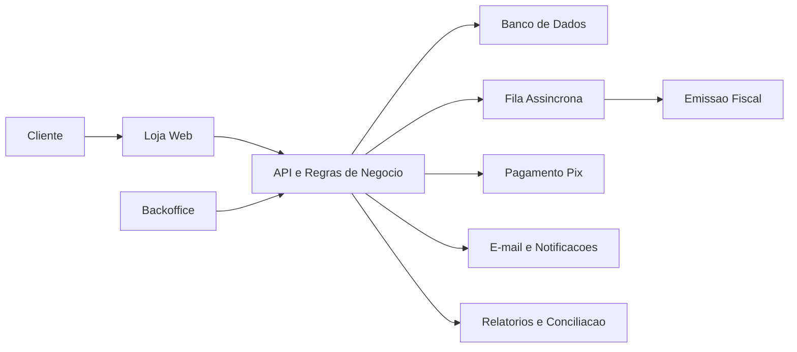

# Sorterama - Produto e Arquitetura

Documento publico para investidores, parceiros e stakeholders.

## Visao Geral

Sorterama e uma plataforma digital para organizar, vender e operar boloes de loteria com controle financeiro, rastreabilidade operacional e automacao fiscal.

A proposta e transformar uma operacao tradicionalmente manual em um produto digital escalavel, com experiencia simples para o cliente e ferramentas de controle para a empresa.

## Problema

Boloes costumam depender de processos fragmentados:

- controle manual de participantes;
- baixa rastreabilidade de pagamentos;
- dificuldade para conciliar valores;
- pouca transparencia para o cliente;
- operacao fiscal e contabil separada do fluxo de venda;
- suporte dependente de planilhas e historico informal.

Esses pontos limitam crescimento, confianca e capacidade de auditoria.

## Solucao

Sorterama centraliza o ciclo de vida da venda:

1. publicacao de ofertas;
2. cadastro e login do cliente;
3. compra de cotas ou pacotes;
4. pagamento Pix;
5. confirmacao automatica;
6. registro financeiro;
7. emissao fiscal da taxa de administracao;
8. notificacao ao cliente;
9. acompanhamento pelo backoffice.

O objetivo do MVP e validar o ciclo completo com seguranca operacional antes de ampliar volume, canais comerciais e automacoes.

## Experiencia do Cliente

O cliente acessa a loja, escolhe uma oferta, realiza o pagamento por Pix e acompanha seus pedidos na area logada.

Fluxos principais:

- compra avulsa de cota;
- pacote mensal com mais de um bolao incluido;
- acompanhamento do pedido;
- acesso a informacoes fiscais quando aplicavel;
- recebimento de comunicacoes transacionais.

## Backoffice

O backoffice foi pensado para dar controle operacional e financeiro para a equipe.

Capacidades previstas no MVP:

- cadastro e publicacao de produtos;
- cadastro de concursos e boloes;
- aprovacao de ofertas;
- consulta de clientes e pedidos;
- acompanhamento financeiro;
- conciliacao entre pedido, pagamento, ledger e nota fiscal;
- exportacao CSV para apoio fiscal e contabil.

## Modelo Financeiro

A plataforma separa os componentes financeiros da venda:

- valor destinado a cota/participacao;
- taxa de administracao;
- descontos ou isencoes;
- status de pagamento;
- eventos de conciliacao.

Essa separacao permite acompanhar receita operacional, valores de terceiros, pendencias, divergencias e informacoes relevantes para contabilidade.

No MVP, a emissao fiscal esta focada na taxa de administracao.

## Arquitetura em Alto Nivel

Sorterama usa uma arquitetura modular, com separacao entre interface, regras de negocio, integracoes e persistencia.

## Principios Tecnicos

- Separacao clara entre produto, dominio, infraestrutura e interfaces.
- Processos criticos assincromos para evitar bloquear o cliente.
- Integracoes externas encapsuladas por adapters.
- Rastreabilidade de pedidos, pagamentos e notas fiscais.
- Base preparada para automacao operacional e analise de dados.
- Deploy conteinerizado para facilitar evolucao e portabilidade.

## Resiliencia Operacional

Fluxos que dependem de provedores externos sao tratados de forma resiliente.

Exemplo: a confirmacao de pagamento nao precisa esperar a emissao fiscal. A nota fiscal pode ser processada em segundo plano, com status acompanhado pelo backoffice.

Isso reduz impacto para o cliente e permite que a operacao trate pendencias sem perder rastreabilidade.

## Dados e Relatorios

A plataforma registra eventos financeiros em uma base interna de ledger, permitindo:

- visao de vendas confirmadas;
- separacao entre cota e taxa de administracao;
- identificacao de pendencias;
- conciliacao com pagamentos;
- conciliacao com emissao fiscal;
- extracao CSV para analises operacionais.

Com o produto homologado, essa base pode evoluir para relatorios mensais de operacao, indicadores de crescimento e materiais para investidores.

## Observabilidade

O MVP ja considera logs e rastreabilidade como parte da operacao.

Objetivos:

- identificar falhas de pagamento, fila e emissao fiscal;
- localizar eventos por pedido, pagamento ou nota;
- apoiar suporte e investigacao;
- reduzir dependencia de analise manual no banco de dados.

Em fases futuras, a observabilidade pode evoluir para dashboards operacionais, alertas automaticos e analise de funil.

## Evolucao Esperada

Apos homologacao, os proximos vetores naturais de evolucao sao:

- melhorar experiencia mobile;
- fortalecer relatorios operacionais e comerciais;
- automatizar mais fluxos de suporte;
- ampliar integracoes fiscais e financeiras;
- criar indicadores mensais para decisao de negocio;
- evoluir controles antifraude e compliance;
- preparar a plataforma para maior volume de usuarios e transacoes.

## Tese de Produto

Sorterama combina tres elementos importantes:

- uma experiencia de compra simples para o consumidor;
- uma operacao interna rastreavel e auditavel;
- uma base tecnica preparada para escalar processos financeiros e fiscais.

O MVP busca provar que o ciclo completo de venda, pagamento, participacao, conciliacao e fiscalizacao pode operar de forma digital e confiavel.
