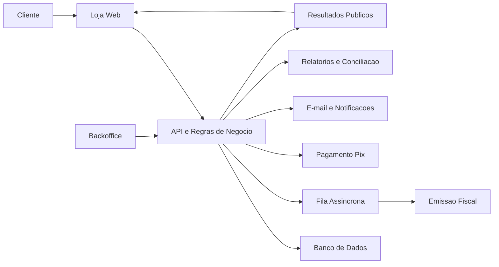

# Sorterama - Produto e Arquitetura

Documento publico para investidores, parceiros e stakeholders.

Ultima revisao: 10/07/2026.

## Visao Geral

Sorterama e uma plataforma digital para organizar, vender e operar boloes de loteria com controle financeiro, rastreabilidade operacional e automacao fiscal.

A proposta e transformar uma operacao tradicionalmente manual em um produto digital escalavel, com experiencia simples para o cliente e ferramentas de controle para a empresa.

## Problema

Boloes costumam depender de processos fragmentados:

- controle manual de participantes;
- baixa rastreabilidade de pagamentos;
- dificuldade para conciliar valores;
- pouca transparencia para o cliente;
- operacao fiscal e contabil separada do fluxo de venda;
- suporte dependente de planilhas e historico informal.

Esses pontos limitam crescimento, confianca e capacidade de auditoria.

## Solucao

Sorterama centraliza o ciclo de vida da venda:

1. publicacao de ofertas;
2. cadastro com validacao de contato;
3. login do cliente com senha ou codigo;
4. compra de cotas ou pacotes;
5. pagamento Pix;
6. confirmacao automatica;
7. registro financeiro;
8. emissao fiscal da taxa de administracao;
9. notificacao ao cliente;
10. publicacao de resultados e premiacoes;
11. liberacao de saldo para resgate;
12. acompanhamento pelo backoffice.

O objetivo do MVP e validar o ciclo completo com seguranca operacional antes de ampliar volume, canais comerciais e automacoes.

## Experiencia do Cliente

O cliente acessa a loja, escolhe uma oferta, realiza o pagamento por Pix e acompanha seus pedidos na area logada.

Fluxos principais:

- onboarding guiado com verificacao por telefone e opcao de fallback por e-mail;
- login com senha ou login por codigo;
- compra avulsa de cota;
- pacote mensal com mais de um bolao incluido;
- acompanhamento do pedido;
- consulta publica de resultados, boloes conferidos e premiacoes;
- consulta de premiacoes e resgates na area logada;
- acesso a informacoes fiscais quando aplicavel;
- recebimento de comunicacoes transacionais.

## Backoffice

O backoffice foi pensado para dar controle operacional e financeiro para a equipe.

Capacidades previstas no MVP:

- cadastro e publicacao de produtos;
- cadastro de concursos e boloes;
- geracao em lote de concursos e boloes do proximo mes;
- cadastro e importacao de jogos/participacoes em loterias oficiais;
- aprovacao de ofertas;
- cadastro de resultado, conferencia dos jogos, registro de premiacao, liberacao de resgate e publicacao publica;
- consulta de clientes e pedidos;
- acompanhamento de onboarding, autenticacao e status operacionais;
- acompanhamento financeiro;
- conciliacao entre pedido, pagamento, ledger e nota fiscal;
- exportacao CSV para apoio fiscal e contabil.

## Diferenciais Operacionais do MVP

Mesmo em fase inicial, o produto ja foi desenhado para reduzir atrito operacional em pontos que costumam travar o crescimento:

- validacao de contato antes da conclusao do cadastro;
- login por codigo para reduzir barreira de acesso;
- pagamento Pix com confirmacao automatica;
- separacao financeira entre cota e taxa de administracao;
- retaguarda administrativa para publicacao, suporte e conciliacao;
- publicacao de resultados com controle do que fica publico;
- conferencia e premiacao desacopladas da venda, reduzindo operacao manual;
- separacao entre premio identificado e saldo disponivel para resgate;
- emissao fiscal desacoplada do momento da compra.

## Modelo Financeiro

A plataforma separa os componentes financeiros da venda:

- valor destinado a cota/participacao;
- taxa de administracao;
- descontos ou isencoes;
- status de pagamento;
- eventos de conciliacao.

Essa separacao permite acompanhar receita operacional, valores de terceiros, pendencias, divergencias e informacoes relevantes para contabilidade.

No MVP, a emissao fiscal esta focada na taxa de administracao.

Premiacoes seguem uma trilha propria:

- resultado/conferencia identifica se houve premio;
- registro financeiro calcula o valor por cota;
- liberacao administrativa transforma premio identificado em saldo disponivel;
- cliente solicita resgate com dados bancarios/Pix verificados.

## Arquitetura em Alto Nivel

Sorterama usa uma arquitetura modular orientada a dominios do produto, com separacao entre experiencia do cliente, operacao administrativa, regras de negocio, integracoes externas e registros operacionais.

Essa separacao permite evoluir cada frente sem misturar responsabilidades:

- a loja concentra a experiencia de compra e acompanhamento;
- o backoffice concentra publicacao, suporte, conciliacao, resultados e resgates;
- a camada de negocio aplica regras de pagamento, premiacao, compliance e idempotencia;
- as integracoes externas ficam isoladas, reduzindo dependencia direta de fornecedores;
- os registros financeiros e operacionais preservam rastreabilidade para suporte, auditoria e analise.

```mermaid
flowchart LR
    Cliente["Cliente"]
    Loja["Loja Web"]
    Backoffice["Backoffice"]
    Plataforma["API e Regras de Negocio"]
    Dados["Banco de Dados"]
    Fila["Fila Assincrona"]
    Pagamento["Pagamento Pix"]
    Fiscal["Emissao Fiscal"]
    Comunicacao["E-mail e Notificacoes"]
    Relatorios["Relatorios e Conciliacao"]
    Resultados["Resultados Publicos"]

    Cliente --> Loja
    Loja --> Plataforma
    Backoffice --> Plataforma
    Plataforma --> Dados
    Plataforma --> Fila
    Plataforma --> Pagamento
    Fila --> Fiscal
    Plataforma --> Comunicacao
    Plataforma --> Relatorios
    Plataforma --> Resultados
    Resultados --> Loja
```

## Modelo Operacional

O MVP foi estruturado em ciclos operacionais claros:

1. o backoffice configura produtos, concursos e boloes;
2. jogos/participacoes em loterias oficiais sao cadastrados ou importados antes da publicacao;
3. a loja publica somente ofertas com informacoes coerentes;
4. o cliente compra cotas ou pacotes e paga por Pix;
5. a confirmacao de pagamento atualiza pedido, registros financeiros e comunicacoes;
6. a emissao fiscal da taxa de administracao ocorre de forma desacoplada;
7. resultados oficiais sao cadastrados apos o concurso;
8. os jogos dos boloes sao conferidos contra o resultado oficial;
9. premiacoes sao registradas, calculadas por cota e liberadas para resgate;
10. resultados publicos sao exibidos sem expor dados sensiveis de clientes, pedidos ou pagamentos.

## Publicacao de Boloes

O backoffice permite dois caminhos de publicacao:

- publicacao manual, usada quando o operador cadastra produto, concurso e bolao individualmente;
- geracao em lote, usada para criar concursos e boloes futuros a partir de modelos configuraveis.

A geracao em lote acelera a preparacao do calendario, mas nao elimina a revisao operacional. Antes de publicar, o operador deve conferir valores, cotas, periodo de vendas, data do sorteio, acumulacao e jogos/participacoes em loterias oficiais vinculados ao bolao.

Essa abordagem evita que ofertas incompletas sejam expostas na loja e cria uma base confiavel para conferencia posterior.

## Jogos, Resultados e Transparencia

Cada bolao pode ter um ou muitos jogos/participacoes em loterias oficiais. Isso prepara a plataforma para jogos simples, combinacoes maiores, fechamentos e desdobramentos.

O ciclo de resultado segue uma separacao importante:

- resultado oficial: dezenas e informacoes publicas do concurso;
- conferencia: comparacao entre resultado oficial e jogos do bolao;
- premiacao operacional: faixas, jogos premiados e melhor acerto;
- premiacao financeira: valor total, valor por cota e saldo por participante;
- publicacao publica: exibicao controlada para clientes e visitantes.

Essa separacao melhora rastreabilidade, reduz retrabalho e evita que dados financeiros internos sejam publicados indevidamente.

## Premiacao e Resgates

Premiacoes identificadas nao entram automaticamente como saldo disponivel. Primeiro, o backoffice registra a premiacao e calcula o valor por cota. Depois, uma acao administrativa libera o saldo para resgate.

Antes da liberacao:

- o premio fica identificado e aguardando liberacao;
- o cliente ainda nao consegue solicitar saque daquele valor.

Depois da liberacao:

- o valor aparece como disponivel na area logada;
- o cliente pode solicitar resgate usando dados bancarios/Pix verificados;
- a comunicacao informa prazo estimado de 5 a 10 dias uteis apos a liberacao.

Esse desenho reduz risco operacional e cria uma trilha clara entre premio informado, premio recebido e saldo liberado ao cliente.

## Principios Tecnicos

- separacao clara entre produto, operacao, regras de negocio e integracoes;
- processos criticos desacoplados para reduzir impacto de falhas externas;
- rastreabilidade de pedidos, pagamentos, notas fiscais, resultados e resgates;
- idempotencia em webhooks, geracao em lote, conferencia e liberacao de premios;
- exposicao publica controlada, sem dados sensiveis de clientes ou operacao interna;
- base preparada para automacao operacional e analise gerencial.

## Resiliencia Operacional

Fluxos que dependem de provedores externos sao tratados de forma resiliente.

Exemplo: a confirmacao de pagamento nao precisa esperar a emissao fiscal. A nota fiscal pode ser processada em segundo plano, com status acompanhado pelo backoffice.

Isso reduz impacto para o cliente e permite que a operacao trate pendencias sem perder rastreabilidade.

Da mesma forma, fluxos de comunicacao e validacao de contato podem seguir por canais alternativos, reduzindo dependencia de um unico meio.

## Dados e Relatorios

A plataforma registra eventos financeiros em uma base interna de ledger, permitindo:

- visao de vendas confirmadas;
- separacao entre cota e taxa de administracao;
- identificacao de pendencias;
- conciliacao com pagamentos;
- conciliacao com emissao fiscal;
- extracao CSV para analises operacionais.

Com o produto homologado, essa base pode evoluir para relatorios mensais de operacao, indicadores de crescimento e materiais para investidores.

## Resultados e Transparencia

A publicacao de resultados passa a ser um eixo de confianca do produto. O backoffice permite registrar o resultado oficial, conferir os boloes, registrar premiacoes, liberar resgates e controlar quando essa informacao sera exibida publicamente.

Para o cliente e para o visitante, a loja pode exibir:

- ultimos resultados publicados;
- resumo de concursos e boloes conferidos;
- boloes premiados;
- valor total de premiacoes registradas;
- pagina publica de resultados com filtros por modalidade, concurso, periodo e status.

Esse desenho melhora a transparencia sem expor informacoes sensiveis de clientes, pedidos ou pagamentos.

Por compliance, a comunicacao do produto usa a expressao "jogos/participacoes em loterias oficiais" nos textos exibidos, documentos legais e materiais operacionais.

Tambem ha uma diretriz de nao expor publicamente detalhes internos de ambiente, deploy, secrets, endpoints internos, comandos operacionais ou configuracoes tecnicas sensiveis.

## Observabilidade

O MVP ja considera logs e rastreabilidade como parte da operacao.

Objetivos:

- identificar falhas de pagamento, fila e emissao fiscal;
- localizar eventos por pedido, pagamento ou nota;
- apoiar suporte e investigacao;
- reduzir dependencia de analise manual no banco de dados.

Em fases futuras, a observabilidade pode evoluir para dashboards operacionais, alertas automaticos e analise de funil.

## Estagio Atual do MVP

Na revisao atual, o produto ja demonstra:

- onboarding funcional com verificacao de contato;
- login por codigo em funcionamento;
- checkout Pix com geracao de chave copia e cola;
- backoffice para operacao e publicacao;
- geracao em lote de boloes e concursos;
- cadastro/importacao de jogos/participacoes em loterias oficiais;
- fluxo operacional de resultado, conferencia, premiacao, liberacao para resgate e publicacao publica;
- trilha financeira e fiscal desacoplada;
- documentacao publica de produto, fluxos operacionais e plano de testes para apoiar homologacao e alinhamento com stakeholders.

## Evolucao Esperada

Apos homologacao, os proximos vetores naturais de evolucao sao:

- melhorar experiencia mobile;
- fortalecer relatorios operacionais e comerciais;
- automatizar mais fluxos de suporte;
- ampliar integracoes fiscais e financeiras;
- criar indicadores mensais para decisao de negocio;
- evoluir controles antifraude e compliance;
- preparar a plataforma para maior volume de usuarios e transacoes.

## Tese de Produto

Sorterama combina tres elementos importantes:

- uma experiencia de compra simples para o consumidor;
- uma operacao interna rastreavel e auditavel;
- uma base tecnica preparada para escalar processos financeiros e fiscais.

O MVP busca provar que o ciclo completo de venda, pagamento, participacao, conciliacao e fiscalizacao pode operar de forma digital e confiavel.
